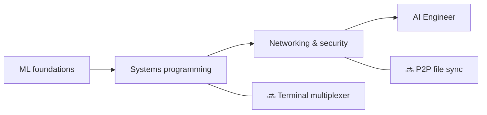

<div align="center">


<h1>👋 Hi, I'm Zuro</h1>

<p><strong>Developer from Astana, Kazakhstan — 15 years old</strong><br>
I build ML systems, developer tools, and computer-science projects from scratch — not from tutorials.</p>

<a href="https://github.com/zuroking">
  
</a>

[](https://github.com/zuroking)
[](https://t.me/Zuroking)
[](mailto:zuroking69@gmail.com)

<br>


</div>

---

<div align="center">

### 🧭 Navigation

[About](#-about-me) · [Toolbox](#️-toolbox) · [Projects](#-featured-projects) · [Roadmap](#️-roadmap) · [Principles](#-engineering-principles)

</div>

---

## 🧠 About me

```python
zuro = {
    "role": "Aspiring AI Engineer",
    "location": "Astana, Kazakhstan",
    "mission": "Understand systems deeply by building them from scratch",
    "focus": [
        "Transformer internals and local LLM inference",
        "Reverse-mode autodiff and ML foundations",
        "Vector search with HNSW",
        "Systems programming, networking, and security",
    ],
    "currently_exploring": ["Ollama", "GGUF", "quantization", "PagedAttention", "KV cache"],
}
```

I build systems and ML tools **from first principles** — no shortcuts through high-level frameworks when the goal is to understand the internals. My projects skip the usual "easy" libraries (Hugging Face `Trainer`, FAISS, Gymnasium, autograd), so I own and understand the underlying mechanics: what happens inside a transformer forward pass, how gradients flow backward through a computation graph, and why an HNSW index finds approximate neighbours fast.

I use AI as a learning and building partner throughout the process — never as a substitute for understanding. Claude Code and OpenCode are part of my workflow; I use [Claude.ai](https://claude.ai) for ideas and architecture decisions, and ChatGPT to unpack code patterns I am still learning.

- 🌱 Exploring local LLM deployment (Ollama, GGUF, quantization), inference internals (PagedAttention, KV cache), and analytic number theory
- 💬 Ask me about transformer internals, reverse-mode autodiff, vector search (HNSW), and async Python architecture
- 🎯 Working toward a Junior AI/ML Engineer role — remote, hybrid, or on-site

## 🛠️ Toolbox

<div align="center">


</div>

## 🚀 Featured projects

Completed projects. Each one starts with an architecture specification, goes through module-level review, and ships with real test results only — never fabricated output.

| Project | What I built | Engineering focus |
|---|---|---|
| [**basicthon**](https://github.com/zuroking/basicthon) | **My largest project:** a bilingual learning repository of 20 isolated Python projects, progressing from a CLI calculator to a CLI + SQLite + REST API capstone. 655 passing tests, with explicit notes marking implementations as educational-only | Structuring a large learning codebase with tests and clear scope boundaries |
| [**kronos-synapse-dialog-core**](https://github.com/zuroking/ZURO_AI) | GPT-style decoder-only language model (~15.3M parameters), CPU-only, written in pure PyTorch — built from scratch to understand transformer internals | Transformer internals: attention, positional encoding, and the training loop |
| [**vector-db-from-scratch**](https://github.com/zuroking/vector-db-from-scratch) | Custom vector database with an HNSW index in pure NumPy — no FAISS, no hnswlib | Approximate nearest-neighbour search and graph-based indexing |
| [**autograd-engine**](https://github.com/zuroking/autograd-engine) | Reverse-mode automatic differentiation engine in pure NumPy — no PyTorch or TensorFlow | Backpropagation and computational graphs — the core of every ML framework |
| [**secure-secrets-vault**](https://github.com/zuroking/secure-secrets-vault) | Encrypted local secrets CLI with master-password protection and key derivation | Applied security: encryption, KDFs, and secret-handling hygiene |
| [**sql-engine-toy**](https://github.com/zuroking/sql-engine-toy) | SQL parser, B-tree index, and simple query planner *(archived by protocol after completion)* | Database internals: parsing, storage structures, query planning |
| [**os-scheduler-sim**](https://github.com/zuroking/os-scheduler-sim) | Scheduler simulator covering Round Robin, priority scheduling, and MLFQ with Gantt-chart visualization | Operating-system concepts: scheduling algorithms and their trade-offs |
| [**http-server-from-scratch**](https://github.com/zuroking/http-server-from-scratch) | HTTP server on raw sockets: request parsing, routing, keep-alive, and basic TLS | Networking fundamentals at the protocol level |
| [**compression-codec**](https://github.com/zuroking/compression-codec) | Huffman + LZ77 codec benchmarked against gzip and zstd | Algorithms and data structures under measurable performance comparison |
| [**geometry_dash_RL_agent**](https://github.com/zuroking/GD_RL_Agent) | DQN agent playing Geometry Dash via screen capture and virtual input, with a custom environment loop — CPU-only | Reinforcement learning in a real game environment |
| [**markov-chatbot-cli**](https://github.com/zuroking/markov-chatbot-cli) | Command-line chatbot built on Markov chains and n-grams | Classical NLP before neural approaches |

## 🗺️ Roadmap

Extending the portfolio beyond ML foundations into systems programming, networking, and security.



| Status | Next project | Goal |
|---|---|---|
| 🔜 | `terminal-multiplexer` | Build a tmux-like multiplexer with sessions and splits |
| 🔜 | `p2p-file-sync` | Build encrypted peer-to-peer file sync with chunk diffs and conflict resolution |

## ⚙️ Engineering principles

- 📐 Decide the architecture **before** writing implementation code — no "figure it out as I go".
- ✅ Enforce strict `mypy`, Pydantic v2 schemas, and Google-style docstrings.
- 🧪 Show real `pytest` output — never fabricated summaries.
- 🔍 Treat module-by-module review as a hard gate, not an afterthought.

---

<div align="center">

### 🤝 Let's build something meaningful

I'm looking for a Junior AI/ML Engineer opportunity — remote, hybrid, or on-site. If my projects resonate with you — or you know someone who's hiring — let's talk.

<a href="https://github.com/zuroking"></a>
<a href="https://t.me/Zuroking"></a>


</div>
