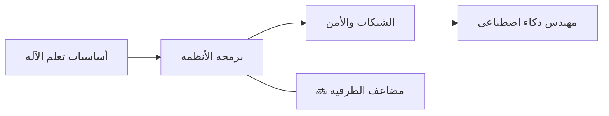

<div align="center">


<h1>👋 مرحباً، أنا زورو (ألديار)</h1>

<p><strong>مطوّر من أستانا، كازاخستان — 15 سنة</strong><br>
أبني أنظمة تعلم الآلة وأدوات المطوّرين ومشاريع علوم الحاسب من الصفر — ليس من الدروس الجاهزة.</p>

<a href="https://github.com/zuroking">
  
</a>

[](https://github.com/zuroking)
[](https://t.me/Zuroking)
[](mailto:zuroking69@gmail.com)

<br>


</div>

---

<div align="center">

🌐 **اللغات:** [English](README.md) · [Русский](README_ru.md) · [Español](README_es.md) · [中文](README_zh.md) · [Français](README_fr.md) · [Deutsch](README_de.md) · [日本語](README_ja.md) · [Português](README_pt.md) · **العربية** · [हिन्दी](README_hi.md)

### 🧭 التنقل

[نبذة عني](#-نبذة-عني) · [الأدوات](#️-الأدوات) · [المشاريع](#-المشاريع-المميزة) · [خارطة الطريق](#️-خارطة-الطريق) · [المبادئ](#-مبادئ-الهندسة)

</div>

---

## 🧠 نبذة عني

```python
zuro = {
    "الدور": "مهندس ذكاء اصطناعي طموح",
    "الموقع": "أستانا، كازاخستان",
    "المهمة": "فهم الأنظمة بعمق عبر بنائها من الصفر",
    "التركيز": [
        "آليات عمل المحولات (Transformers) والاستدلال المحلي لنماذج LLM",
        "التفاضل التلقائي العكسي وأساسيات تعلم الآلة",
        "البحث المتجهي باستخدام HNSW",
        "برمجة الأنظمة والشبكات والأمن",
    ],
    "أستكشف_حالياً": ["Ollama", "GGUF", "التكميم", "PagedAttention", "KV cache"],
}
```

أبني أنظمة وأدوات تعلم الآلة **من المبادئ الأولى** — دون اختصارات عبر أطر عمل عالية المستوى عندما يكون الهدف فهم ما يجري في الداخل. مشاريعي تتجنب المكتبات "السهلة" المعتادة (Hugging Face `Trainer` و FAISS و Gymnasium و autograd)، لذلك أتقن وأفهم الآليات الكامنة: ماذا يحدث داخل التمريرة الأمامية للمحول، وكيف تتدفق التدرجات عكسياً عبر الرسم البياني الحسابي، ولماذا يجد فهرس HNSW الجيران التقريبيين بهذه السرعة.

أستخدم الذكاء الاصطناعي كشريك للتعلم والبناء طوال العملية — وليس كبديل عن الفهم. Claude Code و OpenCode جزء من سير عملي؛ أستخدم [Claude.ai](https://claude.ai) للأفكار وقرارات التصميم المعماري، و ChatGPT لتفكيك أنماط الكود التي ما زلت أتعلمها.

- 🌱 أستكشف النشر المحلي لنماذج LLM (Ollama و GGUF والتكميم)، وآليات الاستدلال الداخلية (PagedAttention و KV cache)، ونظرية الأعداد التحليلية
- 💬 اسألني عن آليات المحولات، والتفاضل التلقائي العكسي، والبحث المتجهي (HNSW)، ومعمارية Python غير المتزامنة
- 🎯 أسعى لفرصة عمل كـ Junior AI/ML Engineer — عن بُعد أو هجين أو حضوري

## 🛠️ الأدوات

<div align="center">


</div>

## 🚀 المشاريع المميزة

مشاريع مكتملة. كل مشروع يبدأ بمواصفة معمارية، ويمر بمراجعة على مستوى الوحدة، ويُسلَّم فقط بنتائج اختبارات حقيقية — دون أي مخرجات مختلقة.

| المشروع | ماذا بنيت | التركيز الهندسي |
|---|---|---|
| [**basicthon**](https://github.com/zuroking/basicthon) | **أكبر مشاريعي:** مستودع تعليمي ثنائي اللغة يضم 20 مشروع Python منفصل، من آلة حاسبة CLI إلى مشروع ختامي بـ CLI + SQLite + REST API. 655 اختبار ناجح، مع ملاحظات صريحة بأن التطبيقات تعليمية فقط | هيكلة قاعدة كود تعليمية كبيرة مع اختبارات وحدود نطاق واضحة |
| [**Tenebris**](TENEBRIS) | نموذج محول فك التشفير الكثيف (~14.59 مليون معامل) وحلقة تدريب على المعالج بلغة PyTorch الخالصة — مجزئ بايتات بدون مكتبات خارجية، تخزين memmap، ومحسن AdamW مخصص ومعايرة Day-0 | تدريب المحولات من المبادئ الأولى: الانتباه، وAdamW المخصص، وتقطيع UTF-8 بالبايت، والمعايرة الحرارية للمعالج |
| [**kronos-synapse-dialog-core**](https://github.com/zuroking/ZURO_AI) | نموذج لغة فك تشفير فقط بأسلوب GPT (~15.3 مليون معلمة)، يعمل على CPU فقط، مكتوب بـ PyTorch الخالص — بُني من الصفر لفهم آليات المحولات | آليات المحولات: الانتباه والترميز الموضعي وحلقة التدريب |
| [**p2p-file-sync**](https://github.com/zuroking/p2p-file-sync) | مزامنة ملفات P2P مشفرة مع Gear CDC chunking، ChaCha20-Poly1305، مصافحة TLS 1.3، SQLite manifest مع vector clocks — 95 اختبار، mypy strict | برمجة الأنظمة: CDC، التشفير، الشبكات، و SQLite internals |
| [**geometry_dash_RL_agent**](https://github.com/zuroking/GD_RL_Agent) | وكيل DQN يلعب Geometry Dash عبر التقاط الشاشة والإدخال الافتراضي، مع حلقة بيئة مخصصة — CPU فقط | التعلم المعزز في بيئة لعب حقيقية |
| [**vector-db-from-scratch**](https://github.com/zuroking/vector-db-from-scratch) | قاعدة بيانات متجهات مخصصة بفهرس HNSW بـ NumPy الخالص — بدون FAISS أو hnswlib | البحث التقريبي عن أقرب الجيران والفهرسة القائمة على الرسوم البيانية |
| [**autograd-engine**](https://github.com/zuroking/autograd-engine) | محرك تفاضل تلقائي عكسي بـ NumPy الخالص — بدون PyTorch أو TensorFlow | الانتشار العكسي والرسوم البيانية الحسابية — جوهر كل إطار عمل لتعلم الآلة |
| [**sql-engine-toy**](https://github.com/zuroking/sql-engine-toy) | محلل SQL وفهرس B-tree ومخطط استعلامات بسيط *(مؤرشف حسب البروتوكول بعد الاكتمال)* | أساسيات قواعد البيانات: التحليل وهياكل التخزين وتخطيط الاستعلامات |
| [**http-server-from-scratch**](https://github.com/zuroking/http-server-from-scratch) | خادم HTTP على مقابس خام: تحليل الطلبات والتوجيه و keep-alive و TLS أساسي | أساسيات الشبكات على مستوى البروتوكول |
| [**secure-secrets-vault**](https://github.com/zuroking/secure-secrets-vault) | أداة CLI محلية مشفرة للأسرار مع حماية بكلمة مرور رئيسية واشتقاق المفاتيح | الأمن التطبيقي: التشفير و KDFs ونظافة التعامل مع الأسرار |
| [**os-scheduler-sim**](https://github.com/zuroking/os-scheduler-sim) | محاكي مجدول يغطي Round Robin والجدولة بالأولوية و MLFQ مع تصور بمخطط جانت | مفاهيم أنظمة التشغيل: خوارزميات الجدولة ومفاضلاتها |
| [**compression-codec**](https://github.com/zuroking/compression-codec) | ترميز Huffman + LZ77 مع قياس أداء مقابل gzip و zstd | الخوارزميات وهياكل البيانات تحت مقارنة أداء قابلة للقياس |
| [**markov-chatbot-cli**](https://github.com/zuroking/markov-chatbot-cli) | روبوت دردشة سطر أوامر مبني على سلاسل ماركوف و n-grams | معالجة اللغة الطبيعية الكلاسيكية قبل الأساليب العصبية |

## 🗺️ خارطة الطريق

توسيع المحفظة إلى ما وراء أساسيات تعلم الآلة نحو برمجة الأنظمة والشبكات والأمن.



| الحالة | المشروع القادم | الهدف |
|---|---|---|
| 🔜 | `mini-container-runtime` | بناء وقت تشغيل حاويات Linux خفيف باستخدام namespaces وcgroups وoverlay filesystems وعزل العمليات |
| 🔜 | `git-from-scratch` | إعادة تنفيذ آليات Git الداخلية مع كائنات مُخطَّطة بالمحتوى وأشجار وcommits وفروع وdiff وpackfiles |
| 🔜 | `compiler-from-scratch` | بناء لغة برمجة مُترجَمة مع محلل لغوي وparser ومدقق أنواع ومحسِّن وbytecode وخلفية كود أصلي |
| 🔜 | `mini-kubernetes` | بناء نظام تنسيق حاويات مع جدولة وreplicas وfailure checks واكتشاف الخدمات والمزامنة |
| 🔜 | `distributed-task-queue` | إنشاء قائمة انتظار مهام متسامحة مع الأخطاء مع workers وإعادة المحاولات والأولويات والمهام المؤجلة والاستمرارية والاستعادة |
| 🔜 | `wasm-runtime` | تنفيذ وقت تشغيل WebAssembly أدنى مع التحقق من الوحدات والذاكرة الخطية والاستيرادات وتنفيذ bytecode |
| 🔜 | `language-server-from-scratch` | بناء تنفيذ LSP للغة مخصصة مع الإكمال التلقائي والتشخيصات والتنقل بين الرموز والتنسيق |
| 🔜 | `terminal-browser` | إنشاء متصفح ويب طرفي مع HTTP وتحليل HTML والروابط التشعبية والتخزين المؤقت والنماذج والعرض الأساسي |
| 🔜 | `object-storage` | بناء خادم تخزين كائنات على غرار S3 مع buckets والبيانات الوصفية والرفع متعدد الأجزاء والمجاميع التدقيقية والنسخ المتماثل |
| 🔜 | `distributed-cache` | بناء ذاكرة تخزين مؤقت موزعة مستوحاة من Redis مع التجزئة والنسخ المتماثل وTTL وسياسات الإخلاء والتجزئة المتسقة |
| 🔜 | `raft-consensus` | تنفيذ خوارزمية توافق Raft مع انتخاب القائد والسجلات المُنسخة والاستمرارية وحقن الأخطاء |
| 🔜 | `message-broker-from-scratch` | بناء وسيط رسائل مستوحى من Kafka مع أقسام ومجموعات مستهلكين وoffsets والاحتفاظ ونسخ السجلات |
| 🔜 | `mini-vm` | بناء آلة افتراضية بمجموعة تعليمات bytecode الخاصة بها ونموذج مكدس/سجل ومدير ذاكرة ومصحح أخطاء ومُجمِّع |
| 🔜 | `filesystem-from-scratch` | تنفيذ نظام ملفات في مساحة المستخدم مع inodes والمجلدات وتخصيص الكتل والتسجيل وإمكانية التخزين المؤقت والاستعادة بعد التعطل |
| 🔜 | `network-stack-from-scratch` | تنفيذ آليات TCP/IP الأساسية في مساحة المستخدم: تأطير Ethernet وARP وIPv4 وICMP وحالة TCP والتوجيه |
| 🔜 | `model-serving-runtime` | بناء خادم استدلال بأسلوب الإنتاج مع التجميع الديناميكي والبث وجدولة الطلبات والتخزين المؤقت وتحسين وحدة المعالجة المركزية |
| 🔜 | `llm-inference-engine` | إنشاء محرك استدلال transformer خفيف مع KV-cache وأوزان مكمّمة وبث الرموز والتنفيذ الواعي بالذاكرة |
| 🔜 | `observability-platform` | بناء حزمة قابلية مراقبة صغيرة للسجلات والمقاييس والآثار والأحداث المنظمة ولوحة معلومات طرفية/ويب |
| 🔜 | `cdc-backup-engine` | بناء نظام نسخ احتياطي تدريجي يستخدم التقسيم المحدد بالمحتوى وإلغاء التكرار والبيانات الوصفية واللقطات والضغط والاستعادة |
| 🔜 | `distributed-database` | بناء قاعدة بيانات موزعة صغيرة تجمع محرك تخزين وWAL ونسخاً متماثلاً وتوافقاً وفهارس وطبقة استعلام تشبه SQL |

## ⚙️ مبادئ الهندسة

- 📐 تحديد المعمارية **قبل** كتابة كود التنفيذ — دون نهج "سأكتشف ذلك أثناء العمل".
- ✅ فرض `mypy` الصارم ومخططات Pydantic v2 و docstrings بأسلوب Google.
- 🧪 عرض مخرجات `pytest` الحقيقية — دون ملخصات مختلقة.
- 🔍 اعتبار المراجعة على مستوى الوحدة بوابة إلزامية، وليست تفصيلاً لاحقاً.

---

<div align="center">

### 🤝 لنبنِ شيئاً ذا قيمة

أبحث عن فرصة عمل كـ Junior AI/ML Engineer — عن بُعد أو هجين أو حضوري. إذا لامست مشاريعي اهتمامك — أو تعرف من يوظّف — لنتحدث.

<a href="https://github.com/zuroking"></a>
<a href="https://t.me/Zuroking"></a>


</div>
