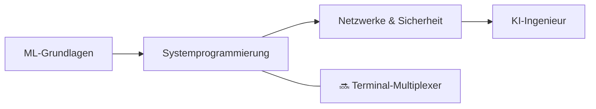

<div align="center">


<h1>👋 Hi, ich bin Zuro (Aldiyar)</h1>

<p><strong>Entwickler aus Astana, Kasachstan — 15 Jahre alt</strong><br>
Ich baue ML-Systeme, Entwickler-Tools und Informatik-Projekte from scratch — nicht nach Tutorials.</p>

<a href="https://github.com/zuroking">
  
</a>

[](https://github.com/zuroking)
[](https://t.me/Zuroking)
[](mailto:zuroking69@gmail.com)

<br>


</div>

---

<div align="center">

🌐 **Sprachen:** [English](README.md) · [Русский](README_ru.md) · [Español](README_es.md) · [中文](README_zh.md) · [Français](README_fr.md) · **Deutsch** · [日本語](README_ja.md) · [Português](README_pt.md) · [العربية](README_ar.md) · [हिन्दी](README_hi.md)

### 🧭 Navigation

[Über mich](#-über-mich) · [Toolbox](#️-toolbox) · [Projekte](#-ausgewählte-projekte) · [Roadmap](#️-roadmap) · [Prinzipien](#-engineering-prinzipien)

</div>

---

## 🧠 Über mich

```python
zuro = {
    "rolle": "Angehender KI-Ingenieur",
    "standort": "Astana, Kasachstan",
    "mission": "Systeme wirklich verstehen, indem ich sie from scratch baue",
    "fokus": [
        "Transformer-Innenleben und lokale LLM-Inferenz",
        "Reverse-Mode Autodiff und ML-Grundlagen",
        "Vektorsuche mit HNSW",
        "Systemprogrammierung, Netzwerke und Sicherheit",
    ],
    "erkunde_gerade": ["Ollama", "GGUF", "Quantisierung", "PagedAttention", "KV cache"],
}
```

Ich baue Systeme und ML-Tools **from first principles** — ohne Abkürzungen durch High-Level-Frameworks, wenn das Ziel ist, die Interna zu verstehen. Meine Projekte verzichten bewusst auf die üblichen "einfachen" Bibliotheken (Hugging Face `Trainer`, FAISS, Gymnasium, autograd), damit ich die zugrunde liegenden Mechanismen wirklich beherrsche und verstehe: was im Forward-Pass eines Transformers passiert, wie Gradienten rückwärts durch den Berechnungsgraphen fließen und warum ein HNSW-Index approximative Nachbarn so schnell findet.

Ich nutze KI als Lern- und Baupartner während des gesamten Prozesses — niemals als Ersatz für Verständnis. Claude Code und OpenCode sind Teil meines Workflows; [Claude.ai](https://claude.ai) nutze ich für Ideen und Architekturentscheidungen, ChatGPT um Code-Patterns aufzuschlüsseln, die ich noch lerne.

- 🌱 Erkunde lokales LLM-Deployment (Ollama, GGUF, Quantisierung), Inferenz-Interna (PagedAttention, KV cache) und analytische Zahlentheorie
- 💬 Frag mich zu Transformer-Innenleben, Reverse-Mode Autodiff, Vektorsuche (HNSW) und asynchroner Python-Architektur
- 🎯 Auf dem Weg zu einer Junior AI/ML Engineer Rolle — remote, hybrid oder vor Ort

## 🛠️ Toolbox

<div align="center">


</div>

## 🚀 Ausgewählte Projekte

Abgeschlossene Projekte. Jedes beginnt mit einer Architekturspezifikation, durchläuft ein Review auf Modulebene und wird nur mit echten Testergebnissen ausgeliefert — niemals mit fabrizierten Outputs.

| Projekt | Was ich gebaut habe | Engineering-Fokus |
|---|---|---|
| [**basicthon**](https://github.com/zuroking/basicthon) | **Mein größtes Projekt:** zweisprachiges Lern-Repository mit 20 isolierten Python-Projekten, vom CLI-Taschenrechner bis zum Capstone mit CLI + SQLite + REST API. 655 bestandene Tests, mit expliziten Hinweisen dass Implementierungen nur zu Lernzwecken dienen | Strukturierung einer großen Lern-Codebasis mit Tests und klaren Scope-Grenzen |
| [**kronos-synapse-dialog-core**](https://github.com/zuroking/ZURO_AI) | GPT-artiges Decoder-only Sprachmodell (~15,3M Parameter), nur CPU, in reinem PyTorch — from scratch gebaut um Transformer-Interna zu verstehen | Transformer-Interna: Attention, Positional Encoding und Training-Loop |
| [**vector-db-from-scratch**](https://github.com/zuroking/vector-db-from-scratch) | Eigene Vektordatenbank mit HNSW-Index in reinem NumPy — ohne FAISS, ohne hnswlib | Approximative Nächste-Nachbarn-Suche und graphbasierte Indexierung |
| [**autograd-engine**](https://github.com/zuroking/autograd-engine) | Reverse-Mode Engine für automatische Differenzierung in reinem NumPy — ohne PyTorch oder TensorFlow | Backpropagation und Berechnungsgraphen — der Kern jedes ML-Frameworks |
| [**secure-secrets-vault**](https://github.com/zuroking/secure-secrets-vault) | Verschlüsseltes lokales Secrets-CLI mit Master-Passwort-Schutz und Key Derivation | Angewandte Sicherheit: Verschlüsselung, KDFs und Hygiene im Umgang mit Secrets |
| [**sql-engine-toy**](https://github.com/zuroking/sql-engine-toy) | SQL-Parser, B-Tree Index und einfacher Query Planner *(nach Abschluss protokollgemäß archiviert)* | Datenbank-Interna: Parsing, Speicherstrukturen, Query-Planung |
| [**os-scheduler-sim**](https://github.com/zuroking/os-scheduler-sim) | Scheduler-Simulator für Round Robin, Priority Scheduling und MLFQ mit Gantt-Chart-Visualisierung | Betriebssystem-Konzepte: Scheduling-Algorithmen und ihre Trade-offs |
| [**http-server-from-scratch**](https://github.com/zuroking/http-server-from-scratch) | HTTP-Server auf Raw Sockets: Request-Parsing, Routing, Keep-Alive und Basis-TLS | Netzwerk-Grundlagen auf Protokollebene |
| [**compression-codec**](https://github.com/zuroking/compression-codec) | Huffman + LZ77 Codec mit Benchmarks gegen gzip und zstd | Algorithmen und Datenstrukturen unter messbarem Leistungsvergleich |
| [**geometry_dash_RL_agent**](https://github.com/zuroking/GD_RL_Agent) | DQN-Agent der Geometry Dash via Screen Capture und virtuellem Input spielt, mit eigenem Environment-Loop — nur CPU | Reinforcement Learning in einer echten Spielumgebung |
| [**markov-chatbot-cli**](https://github.com/zuroking/markov-chatbot-cli) | Kommandozeilen-Chatbot auf Basis von Markov-Ketten und n-Grammen | Klassisches NLP vor neuronalen Ansätzen |
| [**p2p-file-sync**](https://github.com/zuroking/p2p-file-sync) | Verschlüsselter P2P File Sync mit Gear CDC Chunking, ChaCha20-Poly1305, TLS 1.3 Handshake, SQLite Manifest mit Vector Clocks — 95 Tests, mypy strict | Systemprogrammierung: CDC, Kryptographie, Netzwerke und SQLite-Internas |

## 🗺️ Roadmap

Erweiterung des Portfolios über ML-Grundlagen hinaus in Richtung Systemprogrammierung, Netzwerke und Sicherheit.



| Status | Nächstes Projekt | Ziel |
|---|---|---|
| 🔜 | `terminal-multiplexer` | Einen tmux-ähnlichen Multiplexer mit Sessions und Splits bauen |

## ⚙️ Engineering-Prinzipien

- 📐 Architektur **vor** dem Implementierungscode festlegen — kein "schauen wir mal unterwegs".
- ✅ Striktes `mypy`, Pydantic v2 Schemas und Docstrings im Google-Stil durchsetzen.
- 🧪 Echte `pytest`-Outputs zeigen — niemals fabrizierte Zusammenfassungen.
- 🔍 Modulweises Review als harte Hürde betrachten, nicht als Nachgedanke.

---

<div align="center">

### 🤝 Lass uns etwas Bedeutendes bauen

Ich suche eine Junior AI/ML Engineer Stelle — remote, hybrid oder vor Ort. Wenn meine Projekte dich ansprechen — oder du jemanden kennst, der einstellt — lass uns sprechen.

<a href="https://github.com/zuroking"></a>
<a href="https://t.me/Zuroking"></a>


</div>
