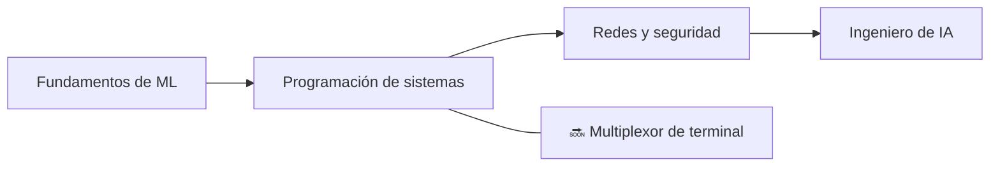

<div align="center">


<h1>👋 Hola, soy Zuro (Aldiyar)</h1>

<p><strong>Desarrollador de Astaná, Kazajistán — 15 años</strong><br>
Construyo sistemas de ML, herramientas para desarrolladores y proyectos de ciencias de la computación desde cero — no a partir de tutoriales.</p>

<a href="https://github.com/zuroking">
  
</a>

[](https://github.com/zuroking)
[](https://t.me/Zuroking)
[](mailto:zuroking69@gmail.com)

<br>


</div>

---

<div align="center">

🌐 **Idiomas:** [English](README.md) · [Русский](README_ru.md) · **Español** · [中文](README_zh.md) · [Français](README_fr.md) · [Deutsch](README_de.md) · [日本語](README_ja.md) · [Português](README_pt.md) · [العربية](README_ar.md) · [हिन्दी](README_hi.md)

### 🧭 Navegación

[Sobre mí](#-sobre-mí) · [Herramientas](#️-herramientas) · [Proyectos](#-proyectos-destacados) · [Roadmap](#️-roadmap) · [Principios](#-principios-de-ingeniería)

</div>

---

## 🧠 Sobre mí

```python
zuro = {
    "rol": "Aspirante a Ingeniero de IA",
    "ubicación": "Astaná, Kazajistán",
    "misión": "Entender los sistemas a fondo construyéndolos desde cero",
    "enfoque": [
        "Funcionamiento interno de transformers e inferencia local de LLMs",
        "Autodiferenciación en modo reverso y fundamentos de ML",
        "Búsqueda vectorial con HNSW",
        "Programación de sistemas, redes y seguridad",
    ],
    "explorando_actualmente": ["Ollama", "GGUF", "cuantización", "PagedAttention", "KV cache"],
}
```

Construyo sistemas y herramientas de ML **desde los primeros principios** — sin atajos a través de frameworks de alto nivel cuando el objetivo es entender el funcionamiento interno. Mis proyectos evitan las librerías "fáciles" habituales (Hugging Face `Trainer`, FAISS, Gymnasium, autograd), por lo que domino y comprendo los mecanismos subyacentes: qué ocurre dentro del forward pass de un transformer, cómo los gradientes fluyen hacia atrás a través del grafo computacional y por qué un índice HNSW encuentra vecinos aproximados tan rápido.

Uso la IA como compañera de aprendizaje y construcción durante todo el proceso — nunca como sustituto de la comprensión. Claude Code y OpenCode forman parte de mi flujo de trabajo; uso [Claude.ai](https://claude.ai) para ideas y decisiones de arquitectura, y ChatGPT para desglosar patrones de código que aún estoy aprendiendo.

- 🌱 Explorando el despliegue local de LLMs (Ollama, GGUF, cuantización), los detalles internos de la inferencia (PagedAttention, KV cache) y la teoría analítica de números
- 💬 Pregúntame sobre el funcionamiento interno de transformers, autodiff en modo reverso, búsqueda vectorial (HNSW) y arquitectura async en Python
- 🎯 Busco una oportunidad como Junior AI/ML Engineer — en remoto, híbrido o presencial

## 🛠️ Herramientas

<div align="center">


</div>

## 🚀 Proyectos destacados

Proyectos completados. Cada uno comienza con una especificación de arquitectura, pasa por revisión a nivel de módulo y se entrega solo con resultados de tests reales — nunca con salidas fabricadas.

| Proyecto | Qué construí | Enfoque de ingeniería |
|---|---|---|
| [**basicthon**](https://github.com/zuroking/basicthon) | **Mi proyecto más grande:** repositorio bilingüe de aprendizaje con 20 proyectos aislados en Python, desde una calculadora CLI hasta un proyecto final con CLI + SQLite + REST API. 655 tests superados, con notas explícitas de que las implementaciones son solo educativas | Estructuración de una gran base de código de aprendizaje con tests y límites de alcance claros |
| [**Tenebris**](TENEBRIS) | Modelo transformador solo-decodificador (~14,59M de parámetros) y bucle de entrenamiento para CPU en PyTorch puro — tokenizador a nivel de bytes, almacenamiento memmap, AdamW personalizado y calibración Day-0 | Entrenamiento de transformers desde primeros principios: attention, AdamW propio, chunking UTF-8 y calibración térmica en CPU |
| [**kronos-synapse-dialog-core**](https://github.com/zuroking/ZURO_AI) | Modelo de lenguaje tipo GPT solo-decodificador (~15,3M de parámetros), solo CPU, escrito en PyTorch puro — construido desde cero para entender el interior de los transformers | Internos de transformers: attention, codificación posicional y bucle de entrenamiento |
| [**p2p-file-sync**](https://github.com/zuroking/p2p-file-sync) | Sincronización de archivos P2P cifrada con chunking Gear CDC, ChaCha20-Poly1305, handshake TLS 1.3, manifest SQLite con relojes vectoriales — 95 tests, mypy strict | Programación de sistemas: CDC, criptografía, redes e internos de SQLite |
| [**geometry_dash_RL_agent**](https://github.com/zuroking/GD_RL_Agent) | Agente DQN que juega a Geometry Dash mediante captura de pantalla y entrada virtual, con un bucle de entorno personalizado — solo CPU | Aprendizaje por refuerzo en un entorno de juego real |
| [**vector-db-from-scratch**](https://github.com/zuroking/vector-db-from-scratch) | Base de datos vectorial personalizada con índice HNSW en NumPy puro — sin FAISS ni hnswlib | Búsqueda aproximada de vecinos más cercanos e indexación basada en grafos |
| [**autograd-engine**](https://github.com/zuroking/autograd-engine) | Motor de diferenciación automática en modo reverso en NumPy puro — sin PyTorch ni TensorFlow | Backpropagation y grafos computacionales — el núcleo de todo framework de ML |
| [**sql-engine-toy**](https://github.com/zuroking/sql-engine-toy) | Parser SQL, índice B-tree y planificador de consultas simple *(archivado por protocolo tras completarse)* | Internos de bases de datos: parsing, estructuras de almacenamiento, planificación de consultas |
| [**http-server-from-scratch**](https://github.com/zuroking/http-server-from-scratch) | Servidor HTTP sobre sockets raw: parsing de peticiones, enrutamiento, keep-alive y TLS básico | Fundamentos de redes a nivel de protocolo |
| [**secure-secrets-vault**](https://github.com/zuroking/secure-secrets-vault) | CLI local cifrado para secretos con protección por contraseña maestra y derivación de claves | Seguridad aplicada: cifrado, KDFs e higiene en el manejo de secretos |
| [**os-scheduler-sim**](https://github.com/zuroking/os-scheduler-sim) | Simulador de planificadores que cubre Round Robin, planificación por prioridad y MLFQ con visualización en diagramas de Gantt | Conceptos de sistemas operativos: алгоритmos de planificación y sus compromisos |
| [**compression-codec**](https://github.com/zuroking/compression-codec) | Códec Huffman + LZ77 con benchmarks frente a gzip y zstd | Algoritmos y estructuras de datos bajo comparación de rendimiento medible |
| [**markov-chatbot-cli**](https://github.com/zuroking/markov-chatbot-cli) | Chatbot de línea de comandos construido con cadenas de Markov y n-gramas | NLP clásico antes de los enfoques neuronales |

## 🗺️ Roadmap

Ampliando el portafolio más allá de los fundamentos de ML hacia la programación de sistemas, redes y seguridad.



| Estado | Próximo proyecto | Objetivo |
|---|---|---|
| 🔜 | `mini-container-runtime` | Construir un runtime de contenedores Linux ligero usando namespaces, cgroups, overlay filesystems y aislamiento de procesos |
| 🔜 | `git-from-scratch` | Reimplementar los internals de Git con objetos con dirección por contenido, árboles, commits, ramas, diff y packfiles |
| 🔜 | `compiler-from-scratch` | Construir un lenguaje compilado con lexer, parser, verificador de tipos, optimizador, bytecode y backend de código nativo |
| 🔜 | `mini-kubernetes` | Construir un sistema de orquestación de contenedores con scheduling, réplicas, health checks, descubrimiento de servicios y reconciliación |
| 🔜 | `distributed-task-queue` | Crear una cola de trabajos tolerante a fallos con workers, reintentos, prioridades, trabajos diferidos, persistencia y recuperación |
| 🔜 | `wasm-runtime` | Implementar un runtime mínimo de WebAssembly con validación de módulos, memoria lineal, importaciones y ejecución de bytecode |
| 🔜 | `language-server-from-scratch` | Construir una implementación LSP para un lenguaje personalizado con autocompletado, diagnósticos, navegación por símbolos y formateo |
| 🔜 | `terminal-browser` | Crear un navegador web en terminal con HTTP, análisis HTML, hipervínculos, caché, formularios y renderizado básico |
| 🔜 | `object-storage` | Construir un servidor de almacenamiento de objetos tipo S3 con buckets, metadatos, subidas multiparte, checksums y replicación |
| 🔜 | `distributed-cache` | Construir una caché distribuida inspirada en Redis con sharding, replicación, TTL, políticas de desalojo y consistent hashing |
| 🔜 | `raft-consensus` | Implementar el algoritmo de consenso Raft con elección de líder, logs replicados, persistencia e inyección de fallos |
| 🔜 | `message-broker-from-scratch` | Construir un broker de mensajes inspirado en Kafka con particiones, grupos de consumidores, offsets, retención y replicación de logs |
| 🔜 | `mini-vm` | Construir una máquina virtual con su propio conjunto de instrucciones, modelo pila/registro, gestor de memoria, depurador y ensamblador |
| 🔜 | `filesystem-from-scratch` | Implementar un sistema de archivos en espacio de usuario con inodos, directorios, asignación de bloques, journaling, caché y recuperación de fallos |
| 🔜 | `network-stack-from-scratch` | Implementar mecanismos TCP/IP en espacio de usuario: tramas Ethernet, ARP, IPv4, ICMP, estado TCP y enrutamiento |
| 🔜 | `model-serving-runtime` | Construir un servidor de inferencia con batching dinámico, streaming, scheduling de peticiones, caché y optimización para CPU |
| 🔜 | `llm-inference-engine` | Crear un motor de inferencia ligero para transformers con KV-cache, pesos cuantizados, streaming de tokens y ejecución con memoria optimizada |
| 🔜 | `observability-platform` | Construir un stack de observabilidad pequeño para logs, métricas, trazas, eventos estructurados y un dashboard de terminal/Web |
| 🔜 | `cdc-backup-engine` | Construir un sistema de backup incremental usando chunking definido por contenido, deduplicación, manifiestos, snapshots, compresión y restauración |
| 🔜 | `distributed-database` | Construir una pequeña base de datos distribuida combinando motor de almacenamiento, WAL, replicación, consenso, índices y una capa de consulta tipo SQL |

## ⚙️ Principios de ingeniería

- 📐 Decidir la arquitectura **antes** de escribir código de implementación — sin "ya lo iré viendo sobre la marcha".
- ✅ Aplicar `mypy` estricto, esquemas Pydantic v2 y docstrings estilo Google.
- 🧪 Mostrar salida real de `pytest` — nunca resúmenes fabricados.
- 🔍 Tratar la revisión módulo por módulo como una barrera obligatoria, no como un trámite posterior.

---

<div align="center">

### 🤝 Construyamos algo significativo

Busco una oportunidad como Junior AI/ML Engineer — en remoto, híbrido o presencial. Si mis proyectos te resultan interesantes — o conoces a alguien que esté contratando — hablemos.

<a href="https://github.com/zuroking"></a>
<a href="https://t.me/Zuroking"></a>


</div>
