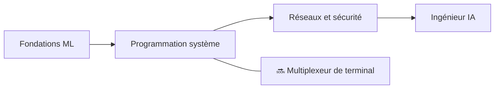

<div align="center">


<h1>👋 Salut, je suis Zuro (Aldiyar)</h1>

<p><strong>Développeur d'Astana, Kazakhstan — 15 ans</strong><br>
Je construis des systèmes ML, des outils pour développeurs et des projets d'informatique from scratch — pas à partir de tutoriels.</p>

<a href="https://github.com/zuroking">
  
</a>

[](https://github.com/zuroking)
[](https://t.me/Zuroking)
[](mailto:zuroking69@gmail.com)

<br>


</div>

---

<div align="center">

🌐 **Langues :** [English](README.md) · [Русский](README_ru.md) · [Español](README_es.md) · [中文](README_zh.md) · **Français** · [Deutsch](README_de.md) · [日本語](README_ja.md) · [Português](README_pt.md) · [العربية](README_ar.md) · [हिन्दी](README_hi.md)

### 🧭 Navigation

[À propos](#-à-propos) · [Boîte à outils](#️-boîte-à-outils) · [Projets](#-projets-phares) · [Roadmap](#️-roadmap) · [Principes](#-principes-dingénierie)

</div>

---

## 🧠 À propos

```python
zuro = {
    "rôle": "Futur ingénieur IA",
    "localisation": "Astana, Kazakhstan",
    "mission": "Comprendre les systèmes en profondeur en les construisant from scratch",
    "focus": [
        "Fonctionnement interne des transformers et inférence LLM locale",
        "Autodiff en mode inverse et fondements du ML",
        "Recherche vectorielle avec HNSW",
        "Programmation système, réseaux et sécurité",
    ],
    "explore_actuellement": ["Ollama", "GGUF", "quantification", "PagedAttention", "KV cache"],
}
```

Je construis des systèmes et des outils ML **à partir des premiers principes** — sans raccourcis via des frameworks haut niveau quand l'objectif est de comprendre les entrailles. Mes projets évitent les bibliothèques "faciles" habituelles (Hugging Face `Trainer`, FAISS, Gymnasium, autograd), je maîtrise donc et je comprends les mécanismes sous-jacents : ce qui se passe à l'intérieur d'un forward pass de transformer, comment les gradients se propagent vers l'arrière à travers le graphe de calcul et pourquoi un index HNSW trouve si vite des voisins approximatifs.

J'utilise l'IA comme partenaire d'apprentissage et de construction tout au long du processus — jamais comme substitut à la compréhension. Claude Code et OpenCode font partie de mon workflow ; j'utilise [Claude.ai](https://claude.ai) pour les idées et les décisions d'architecture, et ChatGPT pour décortiquer les patterns de code que je suis encore en train d'apprendre.

- 🌱 J'explore le déploiement local de LLMs (Ollama, GGUF, quantification), les rouages de l'inférence (PagedAttention, KV cache) et la théorie analytique des nombres
- 💬 Interrogez-moi sur les rouages des transformers, l'autodiff en mode inverse, la recherche vectorielle (HNSW) et l'architecture async en Python
- 🎯 Je vise un poste de Junior AI/ML Engineer — à distance, hybride ou sur site

## 🛠️ Boîte à outils

<div align="center">


</div>

## 🚀 Projets phares

Projets terminés. Chacun commence par une spécification d'architecture, passe par une revue par module et n'est livré qu'avec de vrais résultats de tests — jamais de sorties fabriquées.

| Projet | Ce que j'ai construit | Focus d'ingénierie |
|---|---|---|
| [**basicthon**](https://github.com/zuroking/basicthon) | **Mon plus grand projet :** dépôt d'apprentissage bilingue de 20 projets Python isolés, d'une calculatrice CLI à un projet final CLI + SQLite + REST API. 655 tests réussis, avec des notes explicites indiquant que les implémentations sont uniquement pédagogiques | Structuration d'une grande base de code d'apprentissage avec des tests et des limites de périmètre claires |
| [**kronos-synapse-dialog-core**](https://github.com/zuroking/ZURO_AI) | Modèle de langage de type GPT décodeur seul (~15,3M de paramètres), CPU uniquement, écrit en PyTorch pur — construit from scratch pour comprendre les entrailles des transformers | Rouages des transformers : attention, encodage positionnel et boucle d'entraînement |
| [**vector-db-from-scratch**](https://github.com/zuroking/vector-db-from-scratch) | Base de données vectorielle sur mesure avec index HNSW en NumPy pur — sans FAISS ni hnswlib | Recherche approximative des plus proches voisins et indexation par graphe |
| [**autograd-engine**](https://github.com/zuroking/autograd-engine) | Moteur de différenciation automatique en mode inverse en NumPy pur — sans PyTorch ni TensorFlow | Rétropropagation et graphes de calcul — le cœur de tout framework ML |
| [**secure-secrets-vault**](https://github.com/zuroking/secure-secrets-vault) | CLI local chiffré pour secrets avec protection par mot de passe maître et dérivation de clé | Sécurité appliquée : chiffrement, KDF et hygiène de gestion des secrets |
| [**sql-engine-toy**](https://github.com/zuroking/sql-engine-toy) | Parser SQL, index B-tree et planificateur de requêtes simple *(archivé selon le protocole après achèvement)* | Coulisses des BDD : parsing, structures de stockage, planification de requêtes |
| [**os-scheduler-sim**](https://github.com/zuroking/os-scheduler-sim) | Simulateur d'ordonnanceurs couvrant Round Robin, ordonnancement par priorité et MLFQ avec visualisation en diagramme de Gantt | Concepts de systèmes d'exploitation : algorithmes d'ordonnancement et leurs compromis |
| [**http-server-from-scratch**](https://github.com/zuroking/http-server-from-scratch) | Serveur HTTP sur sockets bruts : parsing des requêtes, routage, keep-alive et TLS de base | Fondamentaux réseau au niveau protocole |
| [**compression-codec**](https://github.com/zuroking/compression-codec) | Codec Huffman + LZ77 benchmarké face à gzip et zstd | Algorithmes et structures de données sous comparaison de performance mesurable |
| [**geometry_dash_RL_agent**](https://github.com/zuroking/GD_RL_Agent) | Agent DQN jouant à Geometry Dash via capture d'écran et entrée virtuelle, avec une boucle d'environnement sur mesure — CPU uniquement | Apprentissage par renforcement dans un vrai environnement de jeu |
| [**markov-chatbot-cli**](https://github.com/zuroking/markov-chatbot-cli) | Chatbot en ligne de commande construit sur chaînes de Markov et n-grammes | NLP classique avant les approches neuronales |
| [**p2p-file-sync**](https://github.com/zuroking/p2p-file-sync) | Synchronisation de fichiers P2P chiffrée avec chunking Gear CDC, ChaCha20-Poly1305, handshake TLS 1.3, manifest SQLite avec horloges vectorielles — 95 tests, mypy strict | Programmation systèmes : CDC, cryptographie, réseaux et internals SQLite |

## 🗺️ Roadmap

Élargir le portfolio au-delà des fondations ML vers la programmation système, les réseaux et la sécurité.



| Statut | Prochain projet | Objectif |
|---|---|---|
| 🔜 | `terminal-multiplexer` | Construire un multiplexeur type tmux avec sessions et splits |

## ⚙️ Principes d'ingénierie

- 📐 Décider de l'architecture **avant** d'écrire le code d'implémentation — pas de "on verra en avançant".
- ✅ Imposer `mypy` strict, schémas Pydantic v2 et docstrings style Google.
- 🧪 Montrer de vraies sorties `pytest` — jamais de résumés fabriqués.
- 🔍 Traiter la revue module par module comme une barrière obligatoire, pas comme une formalité après coup.

---

<div align="center">

### 🤝 Construisons quelque chose de significatif

Je cherche une opportunité en tant que Junior AI/ML Engineer — à distance, hybride ou sur site. Si mes projets vous parlent — ou si vous connaissez quelqu'un qui recrute — discutons-en.

<a href="https://github.com/zuroking"></a>
<a href="https://t.me/Zuroking"></a>


</div>
