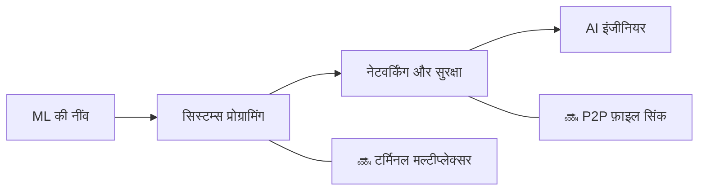

<div align="center">


<h1>👋 नमस्ते, मैं Zuro (Aldiyar) हूँ</h1>

<p><strong>अस्ताना, कज़ाख़स्तान से डेवलपर — 15 वर्ष</strong><br>
मैं ML सिस्टम, डेवलपर टूल्स और कंप्यूटर साइंस प्रोजेक्ट्स स्क्रैच से बनाता हूँ — ट्यूटोरियल्स से नहीं।</p>

<a href="https://github.com/zuroking">
  
</a>

[](https://github.com/zuroking)
[](https://t.me/Zuroking)
[](mailto:zuroking69@gmail.com)

<br>


</div>

---

<div align="center">

🌐 **भाषाएँ:** [English](README.md) · [Русский](README_ru.md) · [Español](README_es.md) · [中文](README_zh.md) · [Français](README_fr.md) · [Deutsch](README_de.md) · [日本語](README_ja.md) · [Português](README_pt.md) · [العربية](README_ar.md) · **हिन्दी**

### 🧭 नेविगेशन

[मेरे बारे में](#-मेरे-बारे-में) · [टूलबॉक्स](#️-टूलबॉक्स) · [प्रोजेक्ट्स](#-चुनिंदा-प्रोजेक्ट्स) · [रोडमैप](#️-रोडमैप) · [सिद्धांत](#-इंजीनियरिंग-सिद्धांत)

</div>

---

## 🧠 मेरे बारे में

```python
zuro = {
    "भूमिका": "भावी AI इंजीनियर",
    "स्थान": "अस्ताना, कज़ाख़स्तान",
    "लक्ष्य": "सिस्टम्स को स्क्रैच से बनाकर गहराई से समझना",
    "फोकस": [
        "Transformer की आंतरिक कार्यप्रणाली और लोकल LLM इंफेरेंस",
        "रिवर्स-मोड ऑटोडिफ और ML की नींव",
        "HNSW के साथ वेक्टर सर्च",
        "सिस्टम्स प्रोग्रामिंग, नेटवर्किंग और सुरक्षा",
    ],
    "वर्तमान_में_सीख_रहा": ["Ollama", "GGUF", "क्वांटाइजेशन", "PagedAttention", "KV cache"],
}
```

मैं सिस्टम्स और ML टूल्स **पहले सिद्धांतों (first principles) से** बनाता हूँ — जब लक्ष्य अंदरूनी तंत्र को समझना हो तो हाई-लेवल फ्रेमवर्क के शॉर्टकट नहीं लेता। मेरे प्रोजेक्ट्स सामान्य "आसान" लाइब्रेरीज़ (Hugging Face `Trainer`, FAISS, Gymnasium, autograd) से बचते हैं, इसलिए मैं अंतर्निहित मैकेनिक्स को वास्तव में समझता और नियंत्रित करता हूँ: transformer के forward pass के अंदर क्या होता है, ग्रेडिएंट्स कंप्यूटेशन ग्राफ़ में पीछे कैसे प्रवाहित होते हैं, और HNSW इंडेक्स अनुमानित पड़ोसियों को इतनी तेज़ी से क्यों ढूँढता है।

मैं पूरी प्रक्रिया के दौरान AI को सीखने और बनाने के साथी के रूप में उपयोग करता हूँ — समझ के विकल्प के रूप में कभी नहीं। Claude Code और OpenCode मेरे वर्कफ़्लो का हिस्सा हैं; मैं आइडियाज़ और आर्किटेक्चर निर्णयों के लिए [Claude.ai](https://claude.ai) और अभी सीख रहे कोड पैटर्न को समझने के लिए ChatGPT का उपयोग करता हूँ।

- 🌱 लोकल LLM डिप्लॉयमेंट (Ollama, GGUF, क्वांटाइजेशन), इंफेरेंस की आंतरिक कार्यप्रणाली (PagedAttention, KV cache) और विश्लेषणात्मक संख्या सिद्धांत एक्सप्लोर कर रहा हूँ
- 💬 मुझसे transformer इंटरनल्स, रिवर्स-मोड ऑटोडिफ, वेक्टर सर्च (HNSW) और async Python आर्किटेक्चर के बारे में पूछें
- 🎯 Junior AI/ML Engineer की भूमिका की तलाश में — रिमोट, हाइब्रिड या ऑन-साइट

## 🛠️ टूलबॉक्स

<div align="center">


</div>

## 🚀 चुनिंदा प्रोजेक्ट्स

पूर्ण किए गए प्रोजेक्ट्स। प्रत्येक आर्किटेक्चर विनिर्देश से शुरू होता है, मॉड्यूल-स्तरीय समीक्षा से गुजरता है, और केवल वास्तविक टेस्ट परिणामों के साथ शिप होता है — कभी भी मनगढ़ंत आउटपुट नहीं।

| प्रोजेक्ट | मैंने क्या बनाया | इंजीनियरिंग फोकस |
|---|---|---|
| [**basicthon**](https://github.com/zuroking/basicthon) | **मेरा सबसे बड़ा प्रोजेक्ट:** 20 अलग-थलग Python प्रोजेक्ट्स वाला द्विभाषी लर्निंग रिपॉजिटरी, CLI कैलकुलेटर से लेकर CLI + SQLite + REST API कैपस्टोन तक। 655 पासिंग टेस्ट, स्पष्ट नोट्स के साथ कि कार्यान्वयन केवल शैक्षिक हैं | टेस्ट्स और स्पष्ट स्कोप सीमाओं के साथ बड़े लर्निंग कोडबेस की संरचना |
| [**kronos-synapse-dialog-core**](https://github.com/zuroking/ZURO_AI) | GPT-स्टाइल डिकोडर-ओनली लैंग्वेज मॉडल (~15.3M पैरामीटर्स), केवल CPU, शुद्ध PyTorch में लिखा — transformer इंटरनल्स को समझने के लिए स्क्रैच से बनाया | Transformer इंटरनल्स: attention, पोज़िशनल एन्कोडिंग और ट्रेनिंग लूप |
| [**vector-db-from-scratch**](https://github.com/zuroking/vector-db-from-scratch) | शुद्ध NumPy में कस्टम वेक्टर डेटाबेस के साथ HNSW इंडेक्स — कोई FAISS नहीं, कोई hnswlib नहीं | अनुमानित निकटतम-पड़ोसी खोज और ग्राफ़-आधारित इंडेक्सिंग |
| [**autograd-engine**](https://github.com/zuroking/autograd-engine) | शुद्ध NumPy में रिवर्स-मोड ऑटोमैटिक डिफरेंशिएशन इंजन — कोई PyTorch या TensorFlow नहीं | बैकप्रोपेगेशन और कंप्यूटेशन ग्राफ़ — हर ML फ्रेमवर्क का मूल |
| [**secure-secrets-vault**](https://github.com/zuroking/secure-secrets-vault) | मास्टर-पासवर्ड सुरक्षा और key derivation के साथ एन्क्रिप्टेड लोकल secrets CLI | एप्लाइड सुरक्षा: एन्क्रिप्शन, KDFs और secrets-हैंडलिंग हाइजीन |
| [**sql-engine-toy**](https://github.com/zuroking/sql-engine-toy) | SQL पार्सर, B-tree इंडेक्स और सरल क्वेरी प्लानर *(पूरा होने के बाद प्रोटोकॉल के अनुसार आर्काइव्ड)* | डेटाबेस इंटरनल्स: पार्सिंग, स्टोरेज स्ट्रक्चर्स, क्वेरी प्लानिंग |
| [**os-scheduler-sim**](https://github.com/zuroking/os-scheduler-sim) | Round Robin, प्रायोरिटी शेड्यूलिंग और MLFQ को कवर करने वाला शेड्यूलर सिम्युलेटर, Gantt-चार्ट विज़ुअलाइज़ेशन के साथ | ऑपरेटिंग सिस्टम कॉन्सेप्ट्स: शेड्यूलिंग एल्गोरिदम और उनके ट्रेड-ऑफ़ |
| [**http-server-from-scratch**](https://github.com/zuroking/http-server-from-scratch) | Raw sockets पर HTTP सर्वर: रिक्वेस्ट पार्सिंग, रूटिंग, keep-alive और बेसिक TLS | प्रोटोकॉल स्तर पर नेटवर्किंग की बुनियाद |
| [**compression-codec**](https://github.com/zuroking/compression-codec) | Huffman + LZ77 कोडेक, gzip और zstd के विरुद्ध बेंचमार्क | मापने योग्य प्रदर्शन तुलना के तहत एल्गोरिदम और डेटा स्ट्रक्चर्स |
| [**geometry_dash_RL_agent**](https://github.com/zuroking/GD_RL_Agent) | स्क्रीन कैप्चर और वर्चुअल इनपुट के माध्यम से Geometry Dash खेलने वाला DQN एजेंट, कस्टम एनवायरनमेंट लूप के साथ — केवल CPU | वास्तविक गेम वातावरण में रीइन्फोर्समेंट लर्निंग |
| [**markov-chatbot-cli**](https://github.com/zuroking/markov-chatbot-cli) | Markov chains और n-grams पर बना कमांड-लाइन चैटबॉट | न्यूरल दृष्टिकोणों से पहले का क्लासिकल NLP |

## 🗺️ रोडमैप

पोर्टफोलियो को ML की नींव से आगे सिस्टम्स प्रोग्रामिंग, नेटवर्किंग और सुरक्षा तक विस्तार।



| स्थिति | अगला प्रोजेक्ट | लक्ष्य |
|---|---|---|
| 🔜 | `terminal-multiplexer` | सेशन्स और स्प्लिट्स के साथ tmux-जैसा मल्टीप्लेक्सर बनाना |
| 🔜 | `p2p-file-sync` | चंक diffs और कॉन्फ्लिक्ट रेज़ोल्यूशन के साथ एन्क्रिप्टेड P2P फ़ाइल सिंक बनाना |

## ⚙️ इंजीनियरिंग सिद्धांत

- 📐 इम्प्लीमेंटेशन कोड लिखने **से पहले** आर्किटेक्चर तय करें — "बनाते-बनाते देख लेंगे" नहीं।
- ✅ सख्त `mypy`, Pydantic v2 स्कीमा और Google-स्टाइल docstrings लागू करें।
- 🧪 केवल वास्तविक `pytest` आउटपुट दिखाएँ — कभी भी मनगढ़ंत सारांश नहीं।
- 🔍 मॉड्यूल-दर-मॉड्यूल समीक्षा को एक अनिवार्य गेट मानें, न कि बाद की औपचारिकता।

---

<div align="center">

### 🤝 आइए कुछ सार्थक बनाएँ

मैं Junior AI/ML Engineer के अवसर की तलाश में हूँ — रिमोट, हाइब्रिड या ऑन-साइट। यदि मेरे प्रोजेक्ट्स आपको पसंद आए — या आप किसी ऐसे व्यक्ति को जानते हैं जो हायरिंग कर रहा है — तो बात करते हैं।

<a href="https://github.com/zuroking"></a>
<a href="https://t.me/Zuroking"></a>


</div>
