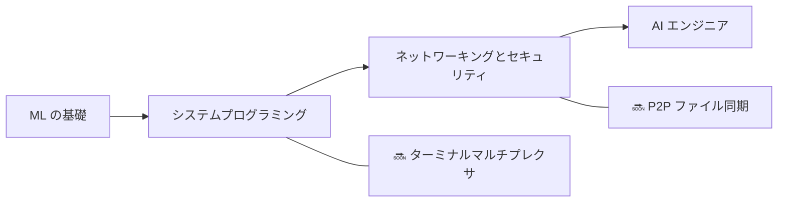

<div align="center">


<h1>👋 こんにちは、Zuro（Aldiyar）です</h1>

<p><strong>カザフスタン・アスタナ出身の開発者 — 15歳</strong><br>
チュートリアルのコピーではなく、ゼロから ML システム、開発者ツール、コンピュータサイエンスのプロジェクトを構築しています。</p>

<a href="https://github.com/zuroking">
  
</a>

[](https://github.com/zuroking)
[](https://t.me/Zuroking)
[](mailto:zuroking69@gmail.com)

<br>


</div>

---

<div align="center">

🌐 **言語:** [English](README.md) · [Русский](README_ru.md) · [Español](README_es.md) · [中文](README_zh.md) · [Français](README_fr.md) · [Deutsch](README_de.md) · **日本語** · [Português](README_pt.md) · [العربية](README_ar.md) · [हिन्दी](README_hi.md)

### 🧭 ナビゲーション

[自己紹介](#-自己紹介) · [ツールボックス](#️-ツールボックス) · [プロジェクト](#-注目プロジェクト) · [ロードマップ](#️-ロードマップ) · [原則](#-エンジニアリング原則)

</div>

---

## 🧠 自己紹介

```python
zuro = {
    "役割": "AIエンジニア志望",
    "拠点": "カザフスタン、アスタナ",
    "ミッション": "ゼロから構築することでシステムを深く理解する",
    "フォーカス": [
        "Transformer の内部構造とローカル LLM 推論",
        "リバースモード自動微分と ML の基礎",
        "HNSW によるベクトル検索",
        "システムプログラミング、ネットワーキング、セキュリティ",
    ],
    "現在探求中": ["Ollama", "GGUF", "量子化", "PagedAttention", "KV cache"],
}
```

私は**第一原理から**システムと ML ツールを構築します — 内部を理解することが目的のときは、高水準フレームワークによる近道はしません。私のプロジェクトは一般的な「簡単な」ライブラリ（Hugging Face `Trainer`、FAISS、Gymnasium、autograd）をあえて使わず、その根底にあるメカニズムを自ら理解し制御します：transformer のフォワードパス内部で何が起きているのか、勾配が計算グラフをどう逆伝播するのか、なぜ HNSW インデックスが近似最近傍をあれほど高速に見つけられるのか。

AI はプロセス全体を通じて学習と構築のパートナーとして活用します — 理解の代替としてではありません。Claude Code と OpenCode は私のワークフローの一部です；アイデアやアーキテクチャの決定には [Claude.ai](https://claude.ai) を、まだ学習中のコードパターンの解読には ChatGPT を使っています。

- 🌱 ローカル LLM デプロイ（Ollama、GGUF、量子化）、推論の内部機構（PagedAttention、KV cache）、解析的整数論を探求中
- 💬 transformer の内部構造、リバースモード自動微分、ベクトル検索（HNSW）、Python 非同期アーキテクチャについて気軽に聞いてください
- 🎯 Junior AI/ML Engineer のポジションを探しています — リモート、ハイブリッド、オンサイトいずれも可

## 🛠️ ツールボックス

<div align="center">


</div>

## 🚀 注目プロジェクト

完成済みのプロジェクト。すべてアーキテクチャ仕様から始まり、モジュール単位のレビューを経て、実際のテスト結果のみを掲載しています — 決して出力を捏造しません。

| プロジェクト | 構築したもの | エンジニアリングの焦点 |
|---|---|---|
| [**basicthon**](https://github.com/zuroking/basicthon) | **最大のプロジェクト：** 20の独立した Python プロジェクトからなるバイリンガル学習リポジトリ。CLI 電卓から CLI + SQLite + REST API のキャップストーンまで。655件のテストがパスし、実装は教育目的であることを明記 | 大規模な学習コードベースの構造化：テストと明確なスコープ境界 |
| [**kronos-synapse-dialog-core**](https://github.com/zuroking/ZURO_AI) | GPT スタイルのデコーダのみ言語モデル（約1,530万パラメータ）、CPU のみ、純粋な PyTorch で記述 — transformer の内部を理解するためにゼロから構築 | Transformer の内部：attention、位置エンコーディング、学習ループ |
| [**vector-db-from-scratch**](https://github.com/zuroking/vector-db-from-scratch) | 純粋な NumPy によるカスタムベクトルデータベースと HNSW インデックス — FAISS も hnswlib も不使用 | 近似最近傍探索とグラフベースのインデックス |
| [**autograd-engine**](https://github.com/zuroking/autograd-engine) | 純粋な NumPy によるリバースモード自動微分エンジン — PyTorch や TensorFlow 不使用 | バックプロパゲーションと計算グラフ — あらゆる ML フレームワークの中核 |
| [**secure-secrets-vault**](https://github.com/zuroking/secure-secrets-vault) | マスターパスワード保護と鍵導出を備えた暗号化ローカル secrets CLI | 応用セキュリティ：暗号化、KDF、secrets 管理の衛生 |
| [**sql-engine-toy**](https://github.com/zuroking/sql-engine-toy) | SQL パーサー、B-tree インデックス、シンプルなクエリプランナー *（完了後プロトコルに従いアーカイブ）* | データベース内部：パース、ストレージ構造、クエリ計画 |
| [**os-scheduler-sim**](https://github.com/zuroking/os-scheduler-sim) | Round Robin、優先度スケジューリング、MLFQ をカバーするスケジューラシミュレータ、ガントチャート可視化付き | OS の概念：スケジューリングアルゴリズムとトレードオフ |
| [**http-server-from-scratch**](https://github.com/zuroking/http-server-from-scratch) | 生ソケット上の HTTP サーバー：リクエスト解析、ルーティング、keep-alive、基本的な TLS | プロトコルレベルのネットワーキング基礎 |
| [**compression-codec**](https://github.com/zuroking/compression-codec) | Huffman + LZ77 コーデック、gzip および zstd とベンチマーク比較 | 測定可能な性能比較の下でのアルゴリズムとデータ構造 |
| [**geometry_dash_RL_agent**](https://github.com/zuroking/GD_RL_Agent) | 画面キャプチャと仮想入力で Geometry Dash をプレイする DQN エージェント、カスタム環境ループ — CPU のみ | 実ゲーム環境での強化学習 |
| [**markov-chatbot-cli**](https://github.com/zuroking/markov-chatbot-cli) | マルコフ連鎖と n-gram で構築されたコマンドライン チャットボット | ニューラルアプローチ以前の古典的 NLP |

## 🗺️ ロードマップ

ポートフォリオを ML の基礎を超えて、システムプログラミング、ネットワーキング、セキュリティへと拡張中。



| ステータス | 次のプロジェクト | 目標 |
|---|---|---|
| 🔜 | `terminal-multiplexer` | セッションと画面分割を備えた tmux 風マルチプレクサを構築 |
| 🔜 | `p2p-file-sync` | チャンク差分と競合解決を備えた暗号化 P2P ファイル同期を構築 |

## ⚙️ エンジニアリング原則

- 📐 実装コードを書く**前**にアーキテクチャを決める —「走りながら考える」はしない。
- ✅ 厳格な `mypy`、Pydantic v2 スキーマ、Google スタイルの docstring を徹底する。
- 🧪 実際の `pytest` 出力のみを示す — 決して要約を捏造しない。
- 🔍 モジュール単位のレビューを事後の形式ではなく、必須のゲートとして扱う。

---

<div align="center">

### 🤝 意味のあるものを一緒に作りましょう

Junior AI/ML Engineer の機会を探しています — リモート、ハイブリッド、オンサイトいずれも可。私のプロジェクトに共感していただけたなら — あるいは採用中の方をご存知なら — ぜひお話ししましょう。

<a href="https://github.com/zuroking"></a>
<a href="https://t.me/Zuroking"></a>


</div>
