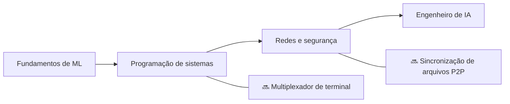

<div align="center">


<h1>👋 Olá, eu sou o Zuro (Aldiyar)</h1>

<p><strong>Desenvolvedor de Astana, Cazaquistão — 15 anos</strong><br>
Construo sistemas de ML, ferramentas para desenvolvedores e projetos de ciência da computação do zero — não a partir de tutoriais.</p>

<a href="https://github.com/zuroking">
  
</a>

[](https://github.com/zuroking)
[](https://t.me/Zuroking)
[](mailto:zuroking69@gmail.com)

<br>


</div>

---

<div align="center">

🌐 **Idiomas:** [English](README.md) · [Русский](README_ru.md) · [Español](README_es.md) · [中文](README_zh.md) · [Français](README_fr.md) · [Deutsch](README_de.md) · [日本語](README_ja.md) · **Português** · [العربية](README_ar.md) · [हिन्दी](README_hi.md)

### 🧭 Navegação

[Sobre mim](#-sobre-mim) · [Ferramentas](#️-ferramentas) · [Projetos](#-projetos-em-destaque) · [Roadmap](#️-roadmap) · [Princípios](#-princípios-de-engenharia)

</div>

---

## 🧠 Sobre mim

```python
zuro = {
    "papel": "Aspirante a Engenheiro de IA",
    "localização": "Astana, Cazaquistão",
    "missão": "Entender sistemas profundamente construindo-os do zero",
    "foco": [
        "Funcionamento interno de transformers e inferência local de LLMs",
        "Autodiferenciação em modo reverso e fundamentos de ML",
        "Busca vetorial com HNSW",
        "Programação de sistemas, redes e segurança",
    ],
    "explorando_atualmente": ["Ollama", "GGUF", "quantização", "PagedAttention", "KV cache"],
}
```

Construo sistemas e ferramentas de ML **a partir dos primeiros princípios** — sem atalhos via frameworks de alto nível quando o objetivo é entender o funcionamento interno. Meus projetos evitam as bibliotecas "fáceis" habituais (Hugging Face `Trainer`, FAISS, Gymnasium, autograd), então domino e compreendo os mecanismos subjacentes: o que acontece dentro do forward pass de um transformer, como os gradientes fluem de volta pelo grafo computacional e por que um índice HNSW encontra vizinhos aproximados tão rápido.

Uso IA como parceira de aprendizado e construção ao longo de todo o processo — nunca como substituto para a compreensão. Claude Code e OpenCode fazem parte do meu fluxo de trabalho; uso [Claude.ai](https://claude.ai) para ideias e decisões de arquitetura, e ChatGPT para destrinchar padrões de código que ainda estou aprendendo.

- 🌱 Explorando deploy local de LLMs (Ollama, GGUF, quantização), detalhes internos de inferência (PagedAttention, KV cache) e teoria analítica dos números
- 💬 Pergunte-me sobre funcionamento interno de transformers, autodiff em modo reverso, busca vetorial (HNSW) e arquitetura async em Python
- 🎯 Em busca de uma oportunidade como Junior AI/ML Engineer — remoto, híbrido ou presencial

## 🛠️ Ferramentas

<div align="center">


</div>

## 🚀 Projetos em destaque

Projetos concluídos. Cada um começa com uma especificação de arquitetura, passa por revisão em nível de módulo e é entregue apenas com resultados reais de testes — nunca com saídas fabricadas.

| Projeto | O que construí | Foco de engenharia |
|---|---|---|
| [**basicthon**](https://github.com/zuroking/basicthon) | **Meu maior projeto:** repositório bilíngue de aprendizado com 20 projetos isolados em Python, de uma calculadora CLI a um capstone com CLI + SQLite + REST API. 655 testes passando, com notas explícitas de que as implementações são apenas educacionais | Estruturação de uma grande base de código de aprendizado com testes e limites de escopo claros |
| [**kronos-synapse-dialog-core**](https://github.com/zuroking/ZURO_AI) | Modelo de linguagem estilo GPT apenas-decodificador (~15,3M de parâmetros), apenas CPU, escrito em PyTorch puro — construído do zero para entender o interior dos transformers | Interna de transformers: attention, codificação posicional e loop de treinamento |
| [**vector-db-from-scratch**](https://github.com/zuroking/vector-db-from-scratch) | Banco de dados vetorial customizado com índice HNSW em NumPy puro — sem FAISS, sem hnswlib | Busca aproximada de vizinhos mais próximos e indexação baseada em grafos |
| [**autograd-engine**](https://github.com/zuroking/autograd-engine) | Motor de diferenciação automática em modo reverso em NumPy puro — sem PyTorch ou TensorFlow | Backpropagation e grafos computacionais — o núcleo de todo framework de ML |
| [**secure-secrets-vault**](https://github.com/zuroking/secure-secrets-vault) | CLI local criptografado para segredos com proteção por senha mestra e derivação de chave | Segurança aplicada: criptografia, KDFs e higiene no manuseio de segredos |
| [**sql-engine-toy**](https://github.com/zuroking/sql-engine-toy) | Parser SQL, índice B-tree e planejador de consultas simples *(arquivado por protocolo após conclusão)* | Internos de bancos de dados: parsing, estruturas de armazenamento, planejamento de consultas |
| [**os-scheduler-sim**](https://github.com/zuroking/os-scheduler-sim) | Simulador de escalonadores cobrindo Round Robin, escalonamento por prioridade e MLFQ com visualização em gráfico de Gantt | Conceitos de sistemas operacionais: algoritmos de escalonamento e seus trade-offs |
| [**http-server-from-scratch**](https://github.com/zuroking/http-server-from-scratch) | Servidor HTTP sobre raw sockets: parsing de requisições, roteamento, keep-alive e TLS básico | Fundamentos de redes em nível de protocolo |
| [**compression-codec**](https://github.com/zuroking/compression-codec) | Codec Huffman + LZ77 com benchmarks contra gzip e zstd | Algoritmos e estruturas de dados sob comparação de desempenho mensurável |
| [**geometry_dash_RL_agent**](https://github.com/zuroking/GD_RL_Agent) | Agente DQN que joga Geometry Dash via captura de tela e entrada virtual, com loop de ambiente customizado — apenas CPU | Aprendizado por reforço em ambiente de jogo real |
| [**markov-chatbot-cli**](https://github.com/zuroking/markov-chatbot-cli) | Chatbot de linha de comando construído com cadeias de Markov e n-gramas | NLP clássico antes das abordagens neurais |

## 🗺️ Roadmap

Expandindo o portfólio além dos fundamentos de ML para programação de sistemas, redes e segurança.



| Status | Próximo projeto | Objetivo |
|---|---|---|
| 🔜 | `terminal-multiplexer` | Construir um multiplexador tipo tmux com sessões e divisões |
| 🔜 | `p2p-file-sync` | Construir sincronização de arquivos P2P criptografada com diffs por chunks e resolução de conflitos |

## ⚙️ Princípios de engenharia

- 📐 Decidir a arquitetura **antes** de escrever código de implementação — sem "vou descobrindo no caminho".
- ✅ Aplicar `mypy` rigoroso, schemas Pydantic v2 e docstrings no estilo Google.
- 🧪 Mostrar saída real de `pytest` — nunca resumos fabricados.
- 🔍 Tratar a revisão módulo a módulo como barreira obrigatória, não como detalhe posterior.

---

<div align="center">

### 🤝 Vamos construir algo significativo

Estou em busca de uma oportunidade como Junior AI/ML Engineer — remoto, híbrido ou presencial. Se meus projetos ressoaram com você — ou se você conhece alguém que está contratando — vamos conversar.

<a href="https://github.com/zuroking"></a>
<a href="https://t.me/Zuroking"></a>


</div>
