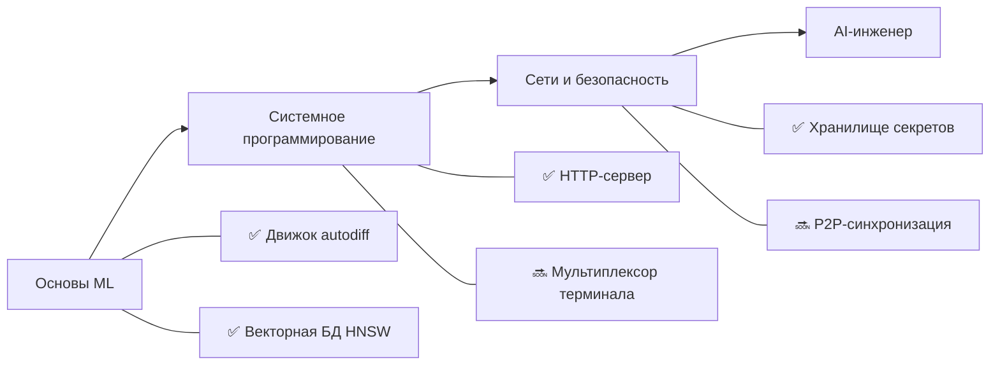

<div align="center">


<h1>👋 Привет, я Алдияр</h1>

<p><strong>15-летний разработчик из Астаны, Казахстан</strong><br>
Создаю ML-системы, инструменты для разработчиков и проекты по computer science с нуля.</p>

<a href="https://github.com/zuroking">
  
</a>

[](https://github.com/zuroking)
[](https://t.me/Zuroking)
[](mailto:zuroking69@gmail.com)

<br>


</div>

---

<div align="center">

### 🧭 Навигация

[Обо мне](#-обо-мне) · [Стек](#️-инструменты) · [Проекты](#-избранные-проекты) · [Roadmap](#️-roadmap) · [Принципы](#-инженерные-принципы)

</div>

---

## 🧠 Обо мне

```python
zuro = {
    "роль": "Будущий AI-инженер",
    "город": "Астана, Казахстан",
    "цель": "Глубоко понимать системы, создавая их с нуля",
    "фокус": [
        "Устройство трансформеров и локальный инференс LLM",
        "Автодифференцирование в обратном режиме и ML-основы",
        "Векторный поиск с HNSW",
        "Системное программирование, сети и безопасность",
    ],
    "изучаю": ["Ollama", "GGUF", "квантизация", "PagedAttention", "KV-кэш"],
}
```

Я использую ИИ, чтобы учиться и создавать проекты, но не как замену пониманию. Claude Code и OpenCode — часть моего рабочего процесса; [Claude.ai](https://claude.ai) помогает с идеями и архитектурными решениями, а ChatGPT — разбирать паттерны в коде, которые я пока изучаю.

## 🛠️ Инструменты

<div align="center">


</div>

## 🚀 Избранные проекты

| Проект | Что я создал | Ключевой фокус |
|---|---|---|
| [**basicthon**](https://github.com/zuroking/basicthon) | **Мой самый большой проект на данный момент:** двуязычный учебный репозиторий из 20 изолированных Python-проектов — от CLI-калькулятора до итогового проекта с CLI, SQLite и REST API; 655 проходящих тестов и явные предупреждения для учебных, не-production реализаций | Архитектура обучения Python |
| [**kronos-synapse-dialog-core**](https://github.com/zuroking/ZURO_AI) | GPT-подобная декодерная языковая модель (~15,3 млн параметров) на чистом PyTorch, только CPU | Устройство трансформеров |
| [**vector-db-from-scratch**](https://github.com/zuroking/vector-db-from-scratch) | Собственная векторная БД с HNSW на чистом NumPy, без FAISS и hnswlib | Приближённый поиск ближайших соседей |
| [**autograd-engine**](https://github.com/zuroking/autograd-engine) | Движок автоматического дифференцирования в обратном режиме на чистом NumPy | Основы ML |
| [**secure-secrets-vault**](https://github.com/zuroking/secure-secrets-vault) | Зашифрованный локальный CLI-менеджер секретов с мастер-паролем и KDF | Прикладная безопасность |
| [**sql-engine-toy**](https://github.com/zuroking/sql-engine-toy) | SQL-парсер, B-дерево и простой планировщик запросов — закрыт по протоколу | Внутреннее устройство баз данных |
| [**http-server-from-scratch**](https://github.com/zuroking/http-server-from-scratch) | HTTP-сервер на raw sockets: парсинг, роутинг, keep-alive и базовый TLS | Сети |
| [**compression-codec**](https://github.com/zuroking/compression-codec) | Кодек Huffman + LZ77 с бенчмарками против gzip/zstd | Алгоритмы |
| [**geometry_dash_RL_agent**](https://github.com/zuroking/GD_RL_Agent) | DQN-агент, играющий в Geometry Dash через захват экрана и виртуальный ввод | Обучение с подкреплением |
| [**markov-chatbot-cli**](https://github.com/zuroking/markov-chatbot-cli) | Чат-бот для командной строки на цепях Маркова и n-граммах | Классический NLP |

> Каждый проект начинается с архитектурной спецификации, проходит ревью модулей и использует только реальные результаты тестов.

## 🗺️ Roadmap



| Статус | Следующий проект | Цель |
|---|---|---|
| 🔜 | `terminal-multiplexer` | Создать мультиплексор наподобие tmux с сессиями и разделением экрана |
| 🔜 | `os-scheduler-sim` | Смоделировать Round Robin, приоритетное планирование и MLFQ с диаграммами Ганта |
| 🔜 | `p2p-file-sync` | Создать зашифрованную P2P-синхронизацию файлов с чанками и разрешением конфликтов |

## ⚙️ Инженерные принципы

- 📐 Определяю архитектуру **до** реализации.
- ✅ Использую строгий `mypy`, схемы Pydantic v2 и docstring'и в стиле Google.
- 🧪 Показываю реальные результаты `pytest`, без выдуманных отчётов.
- 🔍 Считаю ревью каждого модуля обязательным требованием, а не формальностью.

---

<div align="center">

### 🤝 Давайте создадим что-то значимое

Я ищу возможность работать Junior AI/ML Engineer — удалённо, гибридно или в офисе.

<a href="https://github.com/zuroking"></a>
<a href="https://t.me/Zuroking"></a>


</div>
