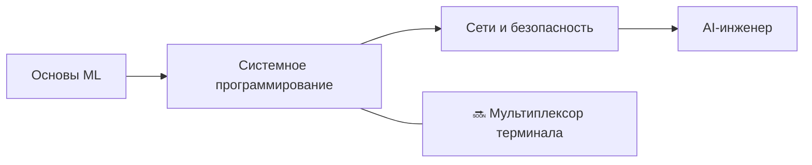

<div align="center">


<h1>👋 Привет, я Зуро (Алдияр)</h1>

<p><strong>Разработчик из Астаны, Казахстан — 15 лет</strong><br>
Создаю ML-системы, инструменты для разработчиков и проекты по computer science с нуля — а не по туториалам.</p>

<a href="https://github.com/zuroking">
  
</a>

[](https://github.com/zuroking)
[](https://t.me/Zuroking)
[](mailto:zuroking69@gmail.com)

<br>


</div>

---

<div align="center">

🌐 **Языки:** [English](README.md) · **Русский** · [Español](README_es.md) · [中文](README_zh.md) · [Français](README_fr.md) · [Deutsch](README_de.md) · [日本語](README_ja.md) · [Português](README_pt.md) · [العربية](README_ar.md) · [हिन्दी](README_hi.md)

### 🧭 Навигация

[Обо мне](#-обо-мне) · [Инструменты](#️-инструменты) · [Проекты](#-избранные-проекты) · [Roadmap](#️-roadmap) · [Принципы](#-инженерные-принципы)

</div>

---

## 🧠 Обо мне

```python
zuro = {
    "роль": "Будущий AI-инженер",
    "город": "Астана, Казахстан",
    "цель": "Глубоко понимать системы, создавая их с нуля",
    "фокус": [
        "Устройство трансформеров и локальный инференс LLM",
        "Автодифференцирование в обратном режиме и основы ML",
        "Векторный поиск с HNSW",
        "Системное программирование, сети и безопасность",
    ],
    "изучаю": ["Ollama", "GGUF", "квантизация", "PagedAttention", "KV-кэш"],
}
```

Я создаю системы и ML-инструменты **с первых принципов** — без обхода сложностей высокоуровневыми фреймворками, когда важно понять внутреннее устройство. Мои проекты обходятся без привычных «лёгких» библиотек (Hugging Face `Trainer`, FAISS, Gymnasium, autograd), поэтому я понимаю и контролирую лежащие в их основе механизмы: что происходит внутри forward pass трансформера, как градиенты распространяются назад по графу вычислений и почему HNSW-индекс так быстро находит приближённых соседей.

Я использую ИИ, чтобы учиться, создавать проекты и понимать, как всё работает в процессе, — но не как замену собственному пониманию. Claude Code и OpenCode — часть моего рабочего процесса; [Claude.ai](https://claude.ai) помогает с идеями и архитектурными решениями, а ChatGPT — разбирать паттерны в коде, которые я ещё изучаю.

- 🌱 Изучаю локальный запуск LLM (Ollama, GGUF, квантизация), внутренние механизмы инференса (PagedAttention, KV-кэш) и аналитическую теорию чисел
- 💬 Спрашивайте меня об устройстве трансформеров, reverse-mode autodiff, векторном поиске (HNSW) и асинхронной архитектуре Python
- 🎯 Стремлюсь к позиции Junior AI/ML Engineer — удалённо, гибридно или в офисе

## 🛠️ Инструменты

<div align="center">


</div>

## 🚀 Избранные проекты

Завершённые проекты. Каждый начинается с архитектурной спецификации, проходит ревью по модулям и содержит только реальные результаты тестов — никаких выдуманных отчётов.

| Проект | Что я создал | Инженерный фокус |
|---|---|---|
| [**basicthon**](https://github.com/zuroking/basicthon) | **Мой самый большой проект:** двуязычный учебный репозиторий из 20 изолированных Python-проектов — от CLI-калькулятора до итогового проекта с CLI, SQLite и REST API. 655 проходящих тестов и явные пометки, что реализации учебные, не для production | Структурирование большого учебного кода: тесты и чёткие границы области применения |
| [**kronos-synapse-dialog-core**](https://github.com/zuroking/ZURO_AI) | GPT-подобная декодерная языковая модель (~15,3 млн параметров), только CPU, на чистом PyTorch — создана с нуля для понимания устройства трансформеров | Устройство трансформеров: attention, позиционные кодировки и цикл обучения |
| [**vector-db-from-scratch**](https://github.com/zuroking/vector-db-from-scratch) | Собственная векторная БД с HNSW-индексом на чистом NumPy — без FAISS и hnswlib | Приближённый поиск ближайших соседей и индексация на графах |
| [**autograd-engine**](https://github.com/zuroking/autograd-engine) | Движок автоматического дифференцирования в обратном режиме на чистом NumPy — без PyTorch и TensorFlow | Backpropagation и графы вычислений — ядро любого ML-фреймворка |
| [**secure-secrets-vault**](https://github.com/zuroking/secure-secrets-vault) | Зашифрованный локальный CLI-менеджер секретов с мастер-паролем и деривацией ключа | Прикладная безопасность: шифрование, KDF и гигиена работы с секретами |
| [**sql-engine-toy**](https://github.com/zuroking/sql-engine-toy) | SQL-парсер, B-дерево и простой планировщик запросов *(закрыт по протоколу после завершения)* | Внутреннее устройство СУБД: парсинг, структуры хранения, планирование запросов |
| [**os-scheduler-sim**](https://github.com/zuroking/os-scheduler-sim) | Симулятор планировщиков: Round Robin, приоритетное планирование и MLFQ с диаграммами Ганта | Концепции операционных систем: алгоритмы планирования и их компромиссы |
| [**http-server-from-scratch**](https://github.com/zuroking/http-server-from-scratch) | HTTP-сервер на raw sockets: парсинг запросов, роутинг, keep-alive и базовый TLS | Основы сетей на уровне протокола |
| [**compression-codec**](https://github.com/zuroking/compression-codec) | Кодек Huffman + LZ77 с бенчмарками против gzip и zstd | Алгоритмы и структуры данных под измеримым сравнением производительности |
| [**geometry_dash_RL_agent**](https://github.com/zuroking/GD_RL_Agent) | DQN-агент, играющий в Geometry Dash через захват экрана и виртуальный ввод, с собственной средой — только CPU | Обучение с подкреплением в реальной игровой среде |
| [**markov-chatbot-cli**](https://github.com/zuroking/markov-chatbot-cli) | Чат-бот для командной строки на цепях Маркова и n-граммах | Классический NLP до нейросетевых подходов |
| [**p2p-file-sync**](https://github.com/zuroking/p2p-file-sync) | Зашифрованная P2P-синхронизация файлов с Gear CDC чанкингом, ChaCha20-Poly1305, TLS 1.3 handshake, SQLite manifest с векторными часами — 95 тестов, mypy strict | Системное программирование: CDC, криптография, сети и внутреннее устройство SQLite |

## 🗺️ Roadmap

Расширяю портфолио за пределы основ ML: системное программирование, сети и безопасность.



| Статус | Следующий проект | Цель |
|---|---|---|
| 🔜 | `terminal-multiplexer` | Создать мультиплексор наподобие tmux с сессиями и разделением экрана |

## ⚙️ Инженерные принципы

- 📐 Определяю архитектуру **до** написания кода — без подхода «разберусь по ходу дела».
- ✅ Использую строгий `mypy`, схемы Pydantic v2 и docstring'и в стиле Google.
- 🧪 Показываю реальные результаты `pytest` — без выдуманных отчётов.
- 🔍 Считаю ревью каждого модуля обязательным этапом, а не формальностью после работы.

---

<div align="center">

### 🤝 Давайте создадим что-то значимое

Я ищу возможность работать Junior AI/ML Engineer — удалённо, гибридно или в офисе. Если мои проекты вам откликнулись — или вы знаете тех, кто ищет сотрудников, — давайте пообщаемся.

<a href="https://github.com/zuroking"></a>
<a href="https://t.me/Zuroking"></a>


</div>
