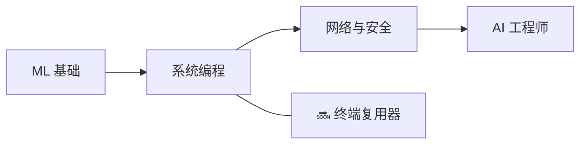

<div align="center">


<h1>👋 你好，我是 Zuro（Aldiyar）</h1>

<p><strong>来自哈萨克斯坦阿斯塔纳的开发者 — 15 岁</strong><br>
我从零开始构建 ML 系统、开发者工具和计算机科学项目 — 而不是照搬教程。</p>

<a href="https://github.com/zuroking">
  
</a>

[](https://github.com/zuroking)
[](https://t.me/Zuroking)
[](mailto:zuroking69@gmail.com)

<br>


</div>

---

<div align="center">

🌐 **语言:** [English](README.md) · [Русский](README_ru.md) · [Español](README_es.md) · **中文** · [Français](README_fr.md) · [Deutsch](README_de.md) · [日本語](README_ja.md) · [Português](README_pt.md) · [العربية](README_ar.md) · [हिन्दी](README_hi.md)

### 🧭 导航

[关于我](#-关于我) · [工具箱](#️-工具箱) · [精选项目](#-精选项目) · [路线图](#️-路线图) · [工程原则](#-工程原则)

</div>

---

## 🧠 关于我

```python
zuro = {
    "角色": "未来的 AI 工程师",
    "地点": "哈萨克斯坦，阿斯塔纳",
    "使命": "通过从零构建来深入理解系统",
    "专注": [
        "Transformer 内部原理与本地 LLM 推理",
        "反向模式自动微分与 ML 基础",
        "基于 HNSW 的向量检索",
        "系统编程、网络与安全",
    ],
    "正在探索": ["Ollama", "GGUF", "量化", "PagedAttention", "KV cache"],
}
```

我以**第一性原理**构建系统和 ML 工具 — 当目标是理解内部机制时，绝不通过高级框架走捷径。我的项目刻意避开常用的“简单”库（Hugging Face `Trainer`、FAISS、Gymnasium、autograd），因此我真正掌握并理解其底层机制：transformer 前向传播内部发生了什么、梯度如何在计算图中反向流动，以及为什么 HNSW 索引能如此快速地找到近似近邻。

我在整个过程中将 AI 作为学习和构建的伙伴 — 而非理解的替代品。Claude Code 和 OpenCode 是我工作流的一部分；我用 [Claude.ai](https://claude.ai) 获取想法和架构决策，用 ChatGPT 来拆解我仍在学习的代码模式。

- 🌱 正在探索本地 LLM 部署（Ollama、GGUF、量化）、推理内部机制（PagedAttention、KV cache）和解析数论
- 💬 欢迎与我交流 transformer 内部原理、反向模式自动微分、向量检索（HNSW）和 Python 异步架构
- 🎯 正在寻求 Junior AI/ML Engineer 的机会 — 远程、混合或现场均可

## 🛠️ 工具箱

<div align="center">


</div>

## 🚀 精选项目

已完成的项目。每个项目都始于架构设计，经过模块级评审，且仅展示真实的测试结果 — 绝不伪造输出。

| 项目 | 我构建了什么 | 工程重点 |
|---|---|---|
| [**basicthon**](https://github.com/zuroking/basicthon) | **我最大的项目：** 包含 20 个独立 Python 项目的双语学习仓库，从 CLI 计算器到 CLI + SQLite + REST API 的综合项目。655 项测试通过，并明确标注实现仅用于学习 | 大型学习代码库的结构化：测试与清晰的范围边界 |
| [**Tenebris**](TENEBRIS) | 基于纯 PyTorch 的稠密仅解码器 Transformer 语言模型（约 14.59M 参数）及 CPU 训练循环 — 零依赖字节分词器、memmap 数据集存储、自定义 AdamW 及 Day-0 硬件校准 | 基于第一性原理的 Transformer 训练：自注意力机制、自定义 AdamW、UTF-8 字节分块与 CPU 散热校准 |
| [**kronos-synapse-dialog-core**](https://github.com/zuroking/ZURO_AI) | 类 GPT 的仅解码器语言模型（约 1530 万参数）、仅 CPU、纯 PyTorch 编写 — 从零构建以理解 transformer 内部原理 | Transformer 内部：注意力机制、位置编码与训练循环 |
| [**p2p-file-sync**](https://github.com/zuroking/p2p-file-sync) | 基于 Gear CDC 分块、ChaCha20-Poly1305、TLS 1.3 握手、带向量时钟的 SQLite 清单的加密 P2P 文件同步 — 95 测试通过，mypy strict | 系统编程：CDC、加密学、网络和 SQLite 内部原理 |
| [**geometry_dash_RL_agent**](https://github.com/zuroking/GD_RL_Agent) | 通过屏幕捕获和虚拟输入游玩 Geometry Dash 的 DQN 智能体，含自定义环境循环 — 仅 CPU | 在真实游戏环境中的强化学习 |
| [**vector-db-from-scratch**](https://github.com/zuroking/vector-db-from-scratch) | 基于纯 NumPy 的自制向量数据库与 HNSW 索引 — 无 FAISS、无 hnswlib | 近似最近邻搜索与基于图的索引 |
| [**autograd-engine**](https://github.com/zuroking/autograd-engine) | 基于纯 NumPy 的反向模式自动微分引擎 — 无 PyTorch 或 TensorFlow | 反向传播与计算图 — 每个 ML 框架的核心 |
| [**sql-engine-toy**](https://github.com/zuroking/sql-engine-toy) | SQL 解析器、B-tree 索引和简单查询规划器 *（完成后按流程归档）* | 数据库内部：解析、存储结构、查询规划 |
| [**http-server-from-scratch**](https://github.com/zuroking/http-server-from-scratch) | 基于裸 sockets 的 HTTP 服务器：请求解析、路由、keep-alive 和基础 TLS | 协议层面的网络基础 |
| [**secure-secrets-vault**](https://github.com/zuroking/secure-secrets-vault) | 带主密码保护和密钥派生的加密本地 secrets CLI | 应用安全：加密、KDF 与 secrets 处理规范 |
| [**os-scheduler-sim**](https://github.com/zuroking/os-scheduler-sim) | 涵盖 Round Robin、优先级调度和 MLFQ 的调度器模拟器，带甘特图可视化 | 操作系统概念：调度算法及其权衡 |
| [**compression-codec**](https://github.com/zuroking/compression-codec) | Huffman + LZ77 编解码器，与 gzip 和 zstd 对比基准测试 | 算法与数据结构在可量化性能对比下 |
| [**markov-chatbot-cli**](https://github.com/zuroking/markov-chatbot-cli) | 基于马尔可夫链和 n-gram 的命令行聊天机器人 | 神经方法之前的经典 NLP |

## 🗺️ 路线图

将作品集从 ML 基础扩展到系统编程、网络与安全领域。



| 状态 | 下一个项目 | 目标 |
|---|---|---|
| 🔜 | `terminal-multiplexer` | 构建类似 tmux 的终端复用器，支持会话和分屏 |

## ⚙️ 工程原则

- 📐 在编写实现代码**之前**先确定架构 — 拒绝“边写边想”。
- ✅ 强制严格的 `mypy`、Pydantic v2 模式和 Google 风格的 docstring。
- 🧪 只展示真实的 `pytest` 输出 — 绝不伪造总结。
- 🔍 将逐模块评审视为硬性关卡，而非事后补充。

---

<div align="center">

### 🤝 让我们一起构建有意义的项目

我正在寻求 Junior AI/ML Engineer 的机会 — 远程、混合或现场均可。如果我的项目引起了你的共鸣 — 或者你认识正在招聘的人 — 欢迎联系我。

<a href="https://github.com/zuroking"></a>
<a href="https://t.me/Zuroking"></a>


</div>
